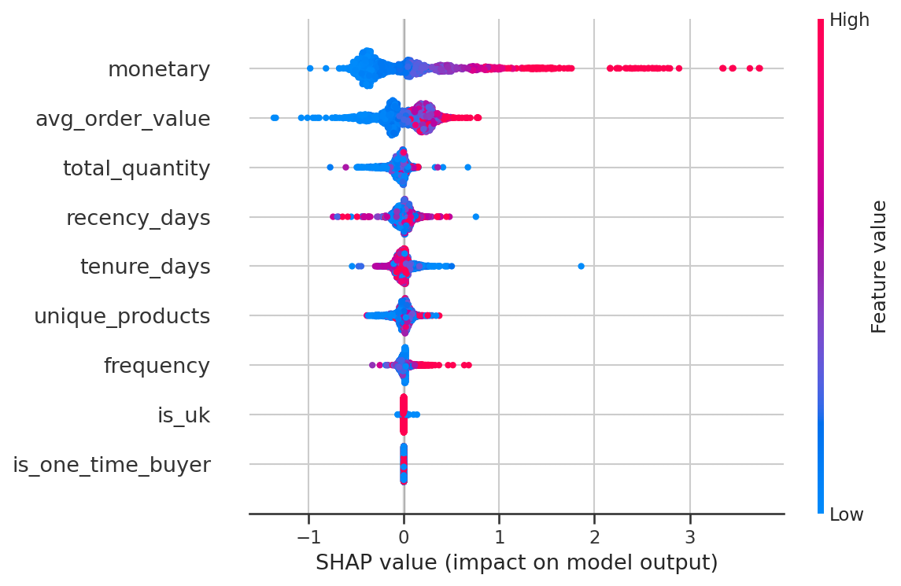
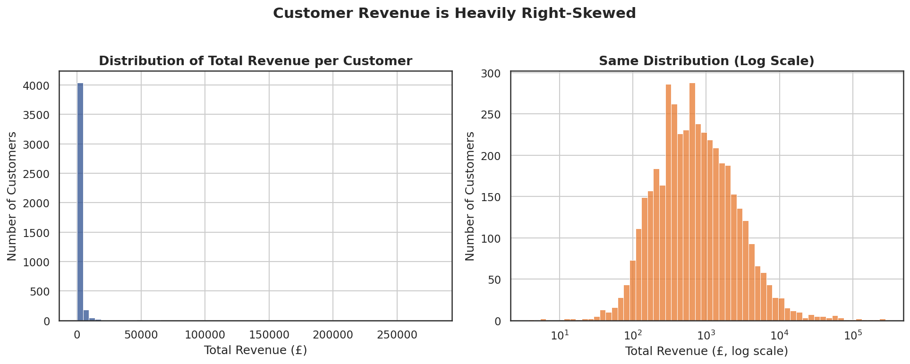
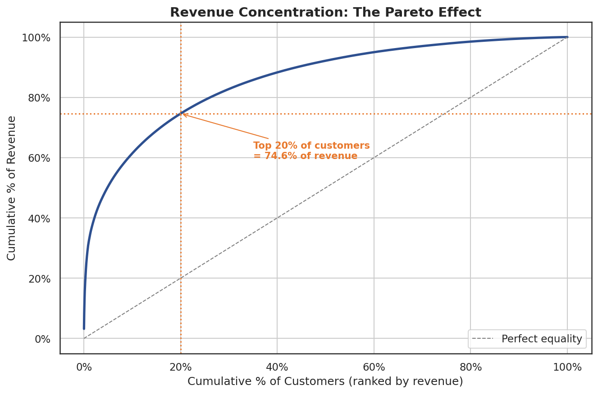
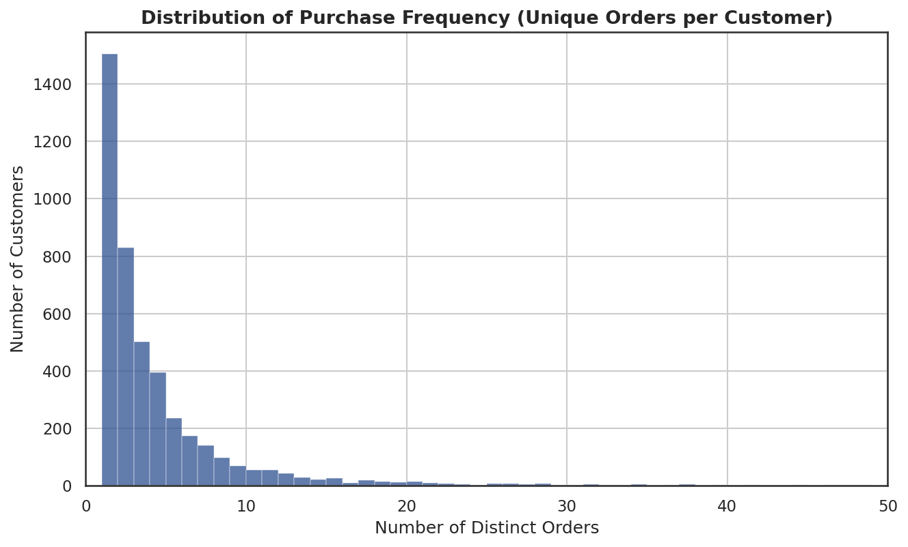
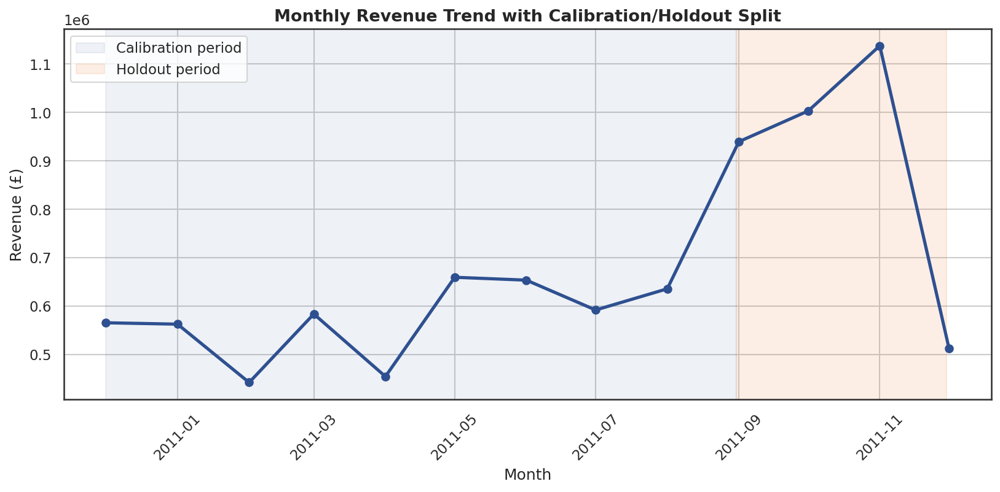
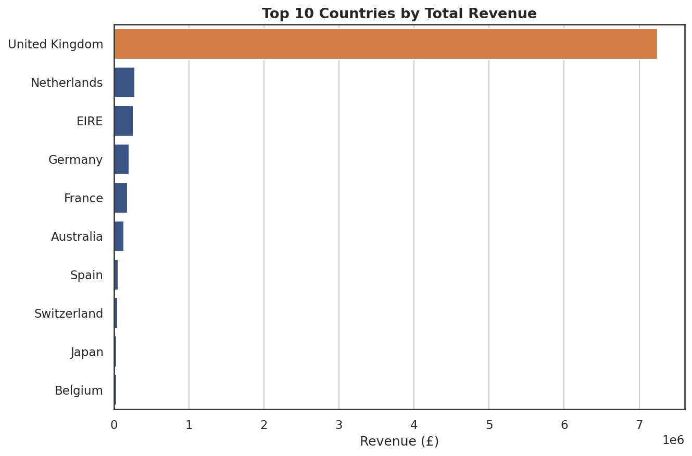

# Customer Lifetime Value (CLV) Prediction

A production-style machine learning project that predicts customer lifetime value for an online retailer, using a **two-stage ("hurdle") model** to handle a heavily zero-inflated target — built end-to-end from raw transactional data to a deployable, interpretable model.

---

## 1. Business Problem

Businesses need to know which customers are worth investing retention and marketing budget in. This project predicts each customer's **future revenue over the next 3 months**, based on their prior purchase behavior, so the business can:

- Identify high-value customers before they've fully "proven" their value historically
- Prioritize retention spend where it has the most impact
- Flag likely churners early
- Move from flat, one-size-fits-all marketing to segmented, data-driven targeting

## 2. Dataset

**Source:** Online Retail dataset (UK-based online retailer, gift/houseware products)
**Size:** 541,909 raw transactions, Dec 2010 – Dec 2011, 4,372 customers, 38 countries
**Grain:** One row per invoice line item (`InvoiceNo`, `StockCode`, `Description`, `Quantity`, `InvoiceDate`, `UnitPrice`, `CustomerID`, `Country`)

**Known limitations (documented, not hidden):**
- ~25% of transactions have no `CustomerID` (≈$1.45M in untrackable revenue) — a real-world data collection gap
- Single year of history (not two), which constrained the calibration/holdout window design
- UK represents 82.8% of revenue — international patterns are based on a thin sample

## 3. Methodology: Calibration / Holdout Split

Rather than a naive historical CLV sum, this project predicts **future** value using a genuine train-into-the-future design:

- **Calibration period:** Dec 2010 – Aug 2011 (9 months) → source of all RFM/behavioral features
- **Holdout period:** Sep 2011 – Nov 2011 (3 months, validated against seasonality) → source of the prediction target
- Customers appearing only in the holdout period (no calibration history) are excluded — a cold-start problem out of scope here

This mirrors how such a model would actually be used in production: predicting forward from known history, never using future information.

## 4. Modeling Approach: Two-Stage Hurdle Model

EDA revealed the target is **zero-inflated**: 43.9% of customers generated no revenue in the holdout window. A single regression model has to learn "will they return" and "how much will they spend" simultaneously, which hurts accuracy. This project builds and compares:

1. **Single-stage baseline** — one regressor predicts revenue directly (including zeros)
2. **Two-stage hurdle model** — Stage 1 classifier predicts P(return); Stage 2 regressor (trained only on returners) predicts spend amount; final prediction = P(return) × E[spend | return]

### Results

| Model | MAE (£) | RMSE (£) | R² | MAPE (nonzero only) |
|---|---|---|---|---|
| Single-stage (Random Forest, best baseline) | 533 | 2,428 | 0.459 | 94.8% |
| **Two-stage hurdle (final model)** | **527** | **2,149** | **0.468** | **81.8%** |

The two-stage model wins on every metric, most notably an **11.5% RMSE reduction** and a **13-point MAPE improvement** — confirming that decomposing the problem to match its structure (zero-inflation) beats a single black-box regressor.

**Notable finding:** Linear/Ridge regression catastrophically failed (MAE in the billions) when combined with a log1p-transformed target, because linear models can extrapolate without bound while tree-based models cannot — an instructive lesson in log-transform + model-family interaction.

## 5. Feature Importance (SHAP + coefficients)

- **Stage 1 (return probability):** `frequency` (past purchase count) dominates by a wide margin — how *often* someone bought matters far more than recency or total spend for predicting return.
- **Stage 2 (spend amount):** `monetary` (past total spend) and `avg_order_value` dominate — spend patterns are sticky among customers who do return.



## 6. Key Visual Insights

**Revenue is heavily right-skewed** (log-normal shape) — informs the log1p target transform:



**Classic Pareto concentration** — top 20% of customers generate 74.6% of revenue:



**Purchase frequency** — median customer ordered only twice all year; ~25%+ are one-time buyers:



**Monthly revenue trend**, with calibration/holdout split overlaid, confirming the split lands on a strong (not seasonally quiet) window:



**Geographic concentration** — UK dominates at 82.8% of revenue:



## 7. Business Recommendations

1. **Segment customers into 4 tiers** using predicted return probability × predicted spend (VIP / Upsell / Win-back / Low-priority) and tailor marketing spend accordingly.
2. **Prioritize frequency-building retention campaigns** (reorder reminders, subscription nudges) over one-off discount promotions — frequency, not recency or spend, drives return probability.
3. **Reallocate marketing budget toward the top 20% of customers**, who generate ~75% of revenue — flat per-customer spend is measurably suboptimal.
4. **Treat the 43.9% non-return rate as an urgent, quantified churn metric** worth executive attention independent of any model.
5. **Fix checkout-level customer ID tracking** — closing the ~25% missing-CustomerID gap would materially expand what any future model can see.

## 8. Project Architecture

```
clv-prediction/
├── data/
│   ├── raw/            # Original untouched data
│   ├── interim/        # Cleaned data (post Phase 3)
│   └── processed/      # Final RFM feature table + target
├── notebooks/           # Narrative EDA/analysis notebook
├── src/
│   ├── data/           # Loading, cleaning, quality diagnostics
│   ├── features/       # RFM + feature engineering
│   ├── models/         # Training, evaluation, two-stage pipeline
│   └── visualization/  # Reusable plotting functions
├── models/              # Serialized trained models + metadata
├── reports/figures/     # Exported charts
├── config/              # config.yaml — paths, split dates, seed
├── tests/               # Unit tests
├── requirements/        # requirements.txt
└── README.md
```

## 9. Installation & Usage

```bash
git clone <this-repo>
cd clv-prediction
pip install -r requirements/requirements.txt
```

Run the pipeline (see `notebooks/01_eda_and_modeling.ipynb` for the full narrative walkthrough), or use the modules directly:

```python
from src.data.load_data import load_raw_transactions
from src.data.clean_data import clean_pipeline
from src.features.build_features import build_feature_target_table

df = load_raw_transactions("data/raw/online_retail.csv")
clean_df = clean_pipeline(df)
# ... split into calibration/holdout, then:
feature_table = build_feature_target_table(calib_df, holdout_df, snapshot_date)
```

## 10. Future Improvements

- Acquire a full two-year dataset to allow a longer calibration window and rolling-origin backtesting (multiple calibration/holdout splits, not just one)
- Add probabilistic CLV models (BG/NBD, Gamma-Gamma) as a benchmark against the ML approach
- Hyperparameter tuning via Bayesian optimization (Optuna) rather than fixed defaults
- Incorporate product-category-level features (currently unused `Description`/`StockCode` detail)
- Build a monitoring pipeline to detect model/data drift if deployed

## 11. Deployment Suggestions (not deployed in this project)

This model could be deployed as:
- A **FastAPI** service exposing a `/predict` endpoint, taking a customer's RFM features and returning predicted CLV
- A **Streamlit** dashboard for the marketing team to explore customer segments interactively
- A **Flask** app integrated into an existing CRM for daily batch scoring

## 12. Technologies Used

Python, pandas, NumPy, scikit-learn, XGBoost, LightGBM, SHAP, matplotlib, seaborn, joblib

## 13. Learning Outcomes

- Designing a leakage-free calibration/holdout split for predictive (not descriptive) CLV
- Diagnosing zero-inflation in a target and architecting a two-stage model to address it
- Understanding failure modes of linear models under log-transformed, skewed targets
- Using SHAP to translate model internals into business-actionable language
- Structuring an ML project as a maintainable, modular codebase rather than a single notebook
